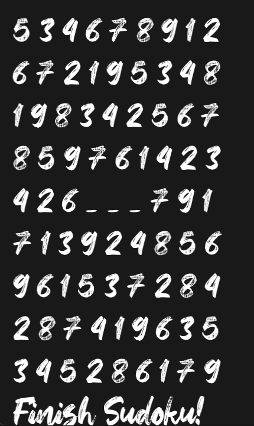

# Sudoku

Author: Liang Yen Chou

Design: It's a 2D Sudoku game.

Text Drawing:

Text is loaded during initialization of the game. It is rendered at runtime.

Display texts by using harfbuzz API to hold text and its contents into glyphs
--> Compute positions of each char based on its glyph information
--> Draw 2 triangles to show 1 texture which corresponds to 1 char from the text. 

Screen Shot:

How To Play:

Fill the sudoku by entering numbers in the order from top to down, from left to right.
Note: This game might be crashed somehow, still working on it.

 
Sources:

Hey October: https://www.1001freefonts.com/hey-october.font\

Shader Program modified from: https://github.com/GenBrg/MarryPrincess/blob/master/Texture2DProgram.cpp#L81 \
Drawing text with OpenGL, Harfbuzz, FreeType: https://learnopengl.com/In-Practice/Text-Rendering, https://github.com/GenBrg/MarryPrincess/blob/master/DrawFont.cpp \

Credit:

This game is inspired and based on the previous project, Freed: https://github.com/Chipxiang/Freed
Thanks for their amazing works.

This game was built with [NEST](NEST.md).
